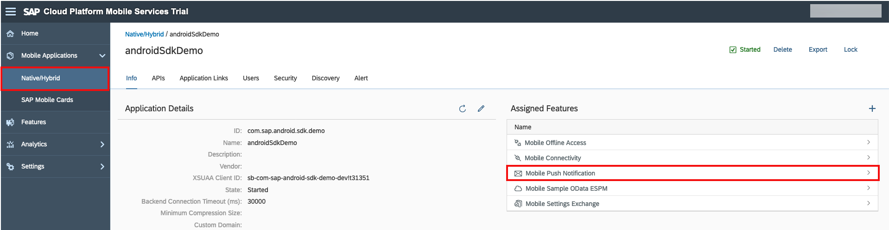
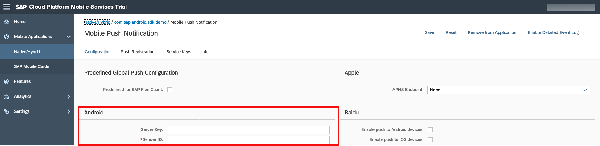
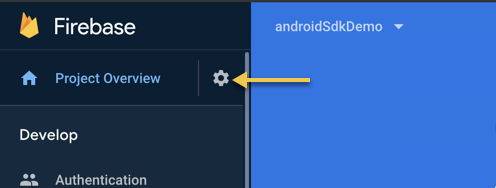
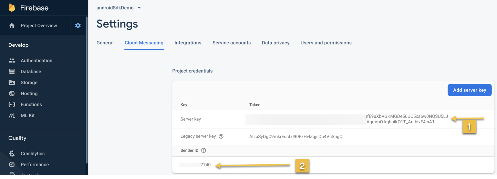
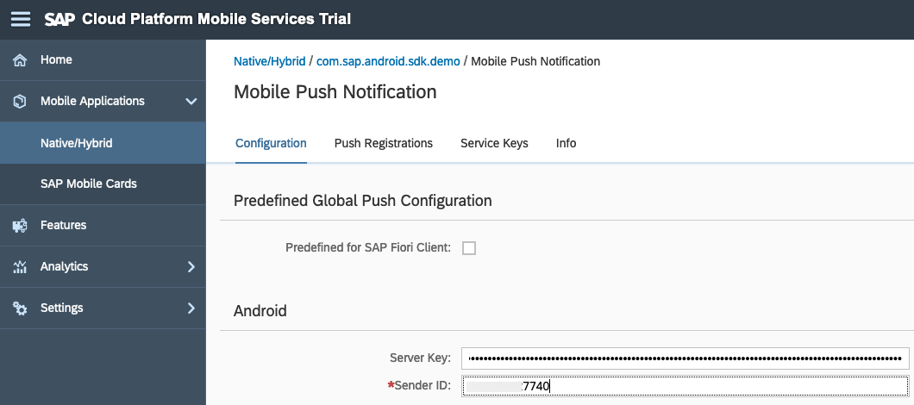
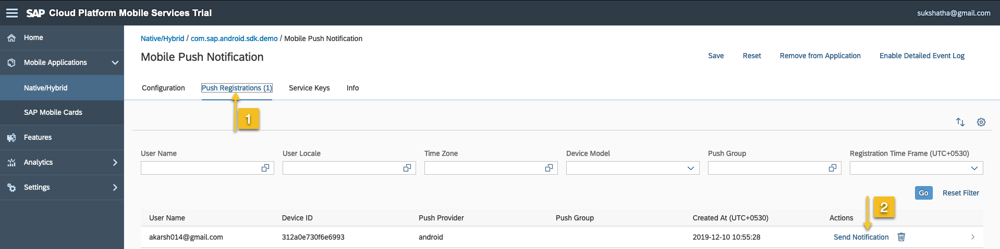
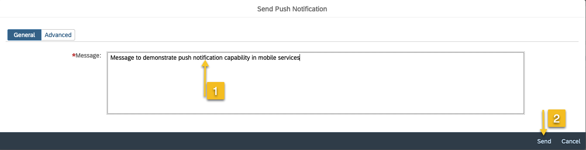
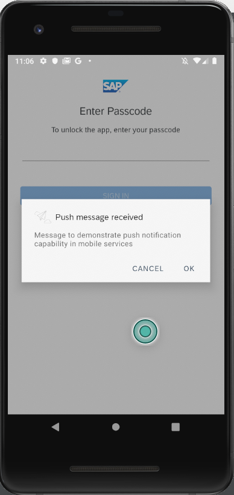

#send push notification to android application.

1) Select the application com.sap.android.sdk.demo from mobile services cockpit.

    1. click on the + icon next to Assigned Features and add Push Notification to the application.
    

    2. In the push notficaiton view, under android tab we need to add server key and sender ID. This information we get it from [Firebase](https://firebase.google.com/)
    

    3. Switch back to firebase console and go to the Project settings of the application.
    

    4. Select the Cloud Messaging tab and copy the Server Key and Sender ID values from Firebase to the SAP Mobile Services Android Push Notification settings screen (step2) and click save.
    
    

    5. To send the push notification click on the push registrations tab from above image. This tab lists all the devices registered for this application.
    select the device to send a notification by clicking "send notification"
    

        A popup appreas to enter the push notification message details, enter a message and click send
    

    6. Notice the application shows the notification.
    
