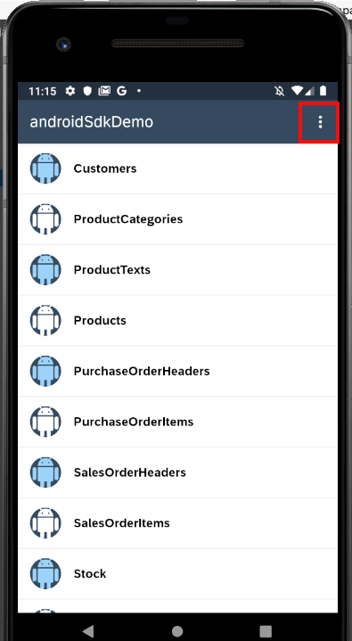
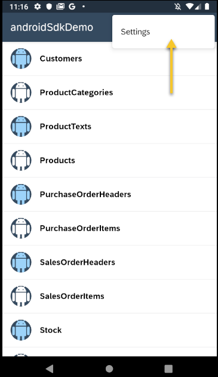
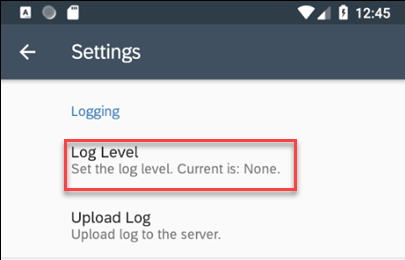
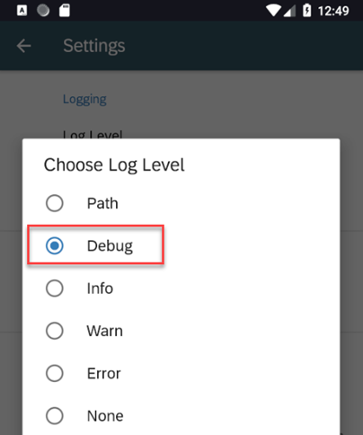
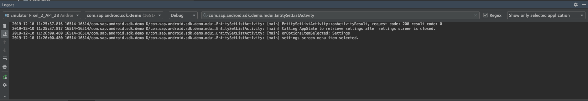
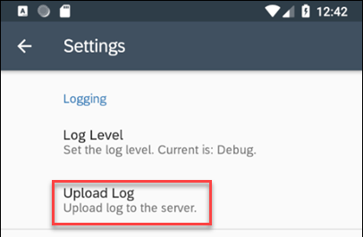
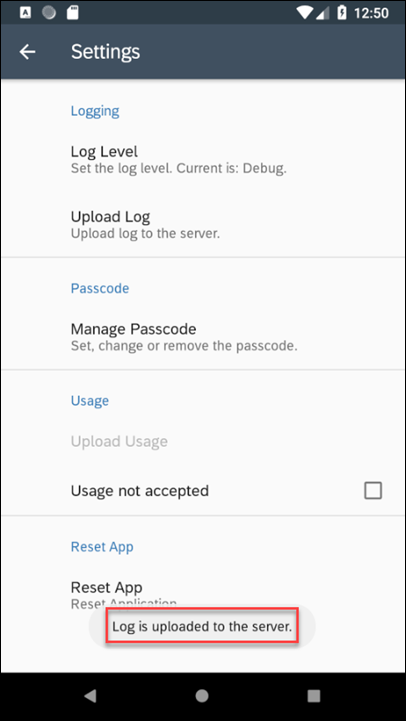

Enabling logging in android application.

1) In Android Studio, on Windows press Control+N or on a Mac press command+O and enter EntitySetListActivity to open EntitySetListActivity.java.

    On Windows press Ctrl+F12 or on a Mac press command+F12 and enter onOptionsItemSelected to move to the onOptionsItemSelected method.

    Note that below method contains two LOGGER statements:
    ```
    @Override
    public boolean onOptionsItemSelected(MenuItem item) {
    LOGGER.debug("onOptionsItemSelected: " + item.getTitle());
    switch (item.getItemId()) {
         case SETTINGS_SCREEN_ITEM:
         LOGGER.debug("settings screen menu item selected.");
         Intent intent = new Intent(this, SettingsActivity.class);
         this.startActivityForResult(intent, SETTINGS_SCREEN_ITEM);
         return true;

         default: return false; }
    }
    ```

    These messages will be logged when the app’s log level is set to Debug or Path and the app’s Settings menu item is opened.

2) Change the log level on the application. Navigate to the entity list screen and open the app's menu

    

    choose settings

    

    select Log Level.
    
    

    Set the level to Debug.

    

3) Examine the Logcat. In the filter add the class name that we are interested in seeing the log from (com.sap.android.sdk.demo.mdui.EntitySetListActivity)
Press the back button to exit the app and notice the logged lines from the foundation library.


4) Upload and view the log.

    Navigate back to the settings menu in the app, and this time, tap the “Upload Log” button.
    

    A Toast message will appear, confirming the upload succeeded.

    

    
