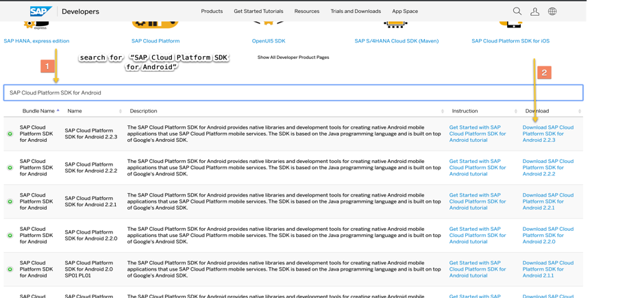

# Initial configuration for Android SDK Application.

Before you Start , make sure you have

1) install [andorid studio](https://developer.android.com/studio/install)

2) Download [SAP Cloud Platform SDK for android](https://developers.sap.com/trials-downloads.html)

3) Extract the contents of the downloaded zip file to a folder on your computer.

4) Run the installation script at the root of the extracted zip. The script installs the Android Wizard plugin in Android Studio and copies the SDK libraries to your local Maven repository.

5) (Recommended) Set the SAP_ANDROID_HOME environment variable to point to your installation folder.

- [Create an application in mobile services cockpit](/Tutorial_1)
- [Create an application from android studio integrated with SAP wizard](/Tutorial_2)
- [Custamize wizard generated application](/Tutorial_3)
- [Send notifications to android application](/Tutorial_4)
