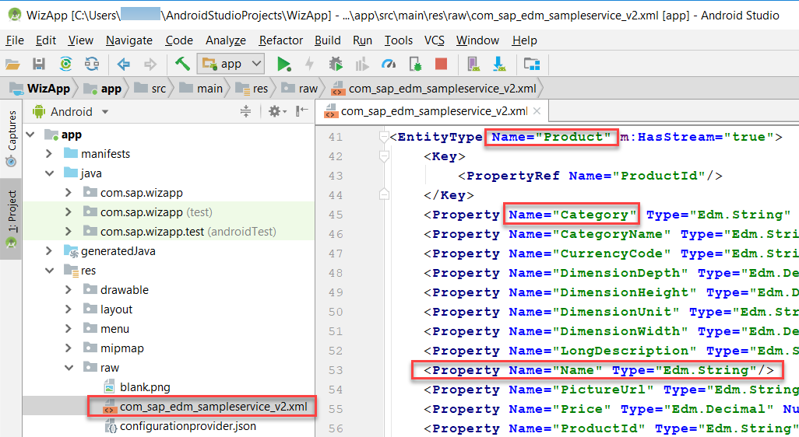

At the end of previous tutorial we geneated an application using android sap sdk wizard. The main view of the applicaiton shows all entities that are present in sample odata service.

1) Tap on the Products entity.

    

2) Notice that it displays the category name rather than the prodct name.

    

3) The category name is displayed (rather than the product name) because the app was generated from the OData service’s metadata which does not indicate which of the many fields from the product entity to display. When creating the sample user interface, the SDK wizard uses the first property found as the value to display. To view the complete metadata document, open the file res/raw/com_sap_edm_sampleservice_v2.xml.

    

4) In this section, the object cell will be configured to show a product’s name, category, description and price. As well, a separator decoration will be added between cells, and the sort order will be modified.

    In Android Studio, on Windows press Ctrl+N or on a Mac press command+O and type ProductsListActivity to open ProductsListFragment.java

    On Windows press Ctrl+F12 or on a Mac press command+F12 and type populateObjectCell to move to the populateObjectCell method.

    Change the parameter in getDataValue from Product.category to Product.name. This will cause the product name to be shown as the headline value of the object cell.

    ```
    DataValue dataValue = productEntity.getDataValue(Product.name);
    ```
    At the end of the populateObjectCell method, find the below lines that set the subheadline, footnote and icon.
    ```java
    objectCell.setSubheadline("Subheadline goes here");
    objectCell.setFootnote("Fottnote goes here");
    if (masterPropertyValue == null || masterPropertyValue.isEmpty()) {
    objectCell.setIcon("?", 0);
    } else {
        objectCell.setIcon(masterPropertyValue.substring(0,1), 0);
    }
    objectCell.setIcon(R.drawable.default_dot, 1, R.string.attachment_item_content_desc);
    objectCell.setIcon("!", 2);
    ```
    Replace them with the code below which will display category, description, and price.

    ```
    dataValue = productEntity.getDataValue(Product.category);
    if (dataValue != null) {
        objectCell.setSubheadline(dataValue.toString());
    }
    dataValue = productEntity.getDataValue(Product.shortDescription);
    if (dataValue != null) {
        objectCell.setFootnote(dataValue.toString());
    }
    dataValue = productEntity.getDataValue(Product.price);
    if (dataValue != null) {
        objectCell.setStatusWidth(200);
        objectCell.setStatus("$ " + dataValue.toString(), 1);
    }
    ```
    On Windows press Ctrl+F12 or on a Mac press command+F12 and type setupRecyclerView to move to the setupRecyclerView method.
    After the if (recyclerView == null) line, paste the following code that adds a divider between product items.

    ```
    LinearLayoutManager llm = new LinearLayoutManager(this);
    DividerItemDecoration dividerItemDecoration = new DividerItemDecoration(recyclerView.getContext(), llm.getOrientation());
    recyclerView.addItemDecoration(dividerItemDecoration);
    recyclerView.setLayoutManager(llm);
    ```
    If classes LinearLayoutManager and DividerItemDecoration appear red, this indicates that Android Studio could not locate the classes. Select each class and on Windows press Alt+Enter or on a Mac press option+return to make use of Android Studio quick fix to add the missing imports.

    An alternate option is to enable the below setting.
    

    On Windows press Ctrl+N or on a Mac press command+O and type Repository to open Repository.java.

    On Windows press Ctrl+F12 or on a Mac press command+F12 and type initialRead to move to the initialRead method.

    Below the line that calls the orderBy method of dataQuery, add the following to specify the sort order to be by category and then by name for products.
    
    ```
    if (entitySet.getEntityType() == ESPMContainerMetadata.EntityTypes.product) {
     dataQuery.thenBy(Product.name, SortOrder.ASCENDING);
    }   
    ```
    After the change the code should appear as shown below.
    ```
    if (entitySet.getEntityType() == ESPMContainerMetadata.EntityTypes.product) {
     dataQuery.thenBy(Product.name, SortOrder.ASCENDING);
     if (entitySet.getEntityType() == ESPMContainerMetadata.EntityTypes.product) {
         dataQuery.thenBy(Product.name, SortOrder.ASCENDING);
     }
    }  
    ```

    Run the app and notice the products screen has been formatted to show the product’s name, category, description, price and the entries are now sorted by category and then name.
    
    