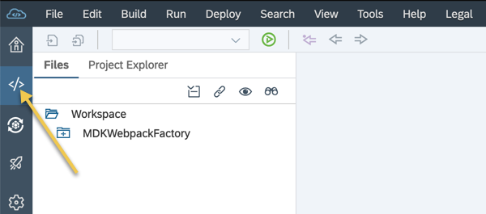
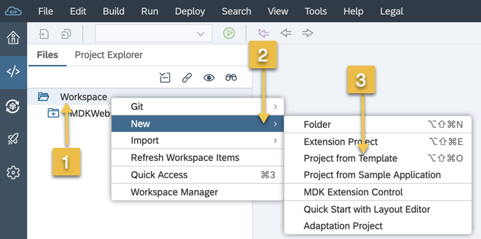
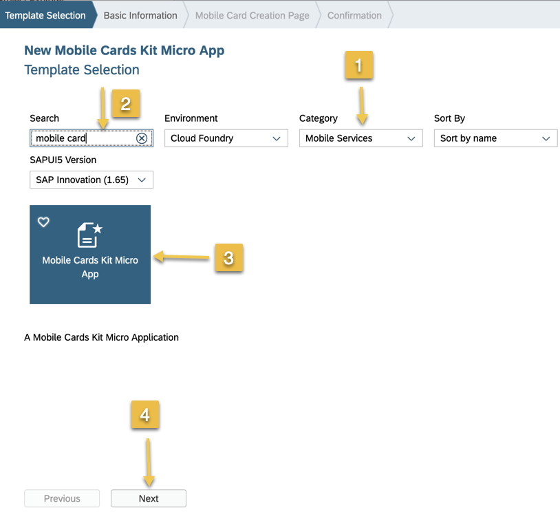
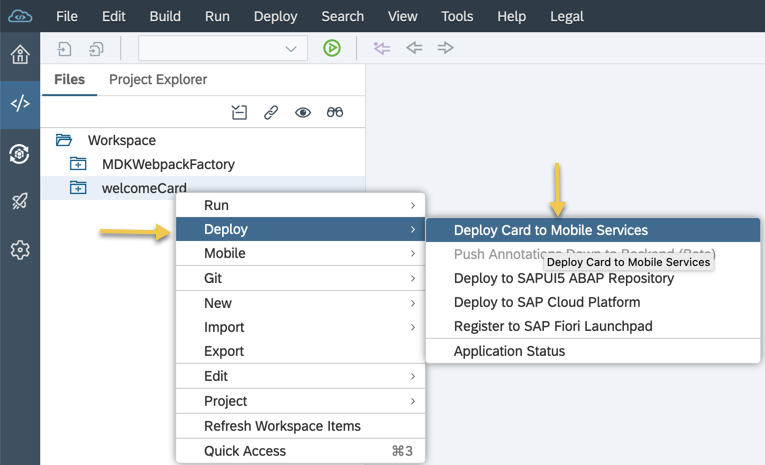
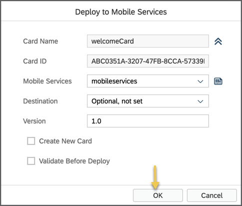

Create Welcome Card

1) Launch the SAP Web IDE and select the development perspective by clicking on the icon in the left panel.

2) Right click on Workspace folder and select New -> Project from template

3) select mobile services from Category drop down, and in the search bar "mobile card". you get a template "mobile cards kit micro app" and click next.

4) Give a name "welcome card" and click next. 

5) select Neo as environment to deploy the welcome card application, select the "sample template welcome card" from template and click finish.

6) Right click on the project -> Deploy -> Deploy Card to Mobile Services.

7) Click OK on the popup to deploy app to mobile services.
