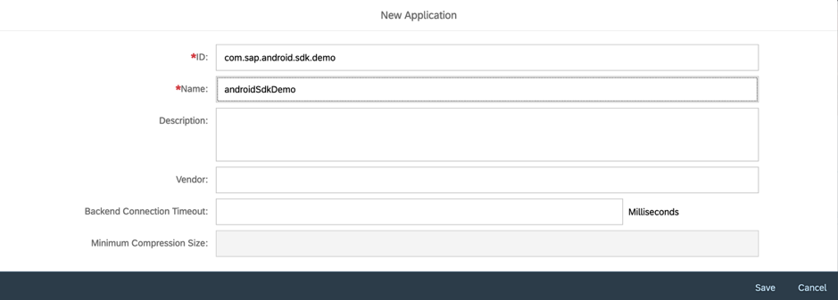

Creating an applicaiton in mobile services cockpit.

1) Navigate to [SAP Cloud Platform Mobile Services cockpit on Cloud Foundry Environment] (https://developers.sap.com/tutorials/fiori-ios-hcpms-setup.html)

2) On the home screen of mobile services cockpit, select "Create new app"

3) Fill in the required fields and click save

4) Once an application is created, a default macro service "Mobile Settings Exchange" is assigned to app. Now go ahead and assing other macro services required. In this tutorial assign offline, mobile connectivity and mobile sample odata espm. 
click on + next to assigned features tab. 

5) Below is the screenshot describing the list of macro services required for this workshop.

6) We access this configuration from android studio integrated with SAP wizard.