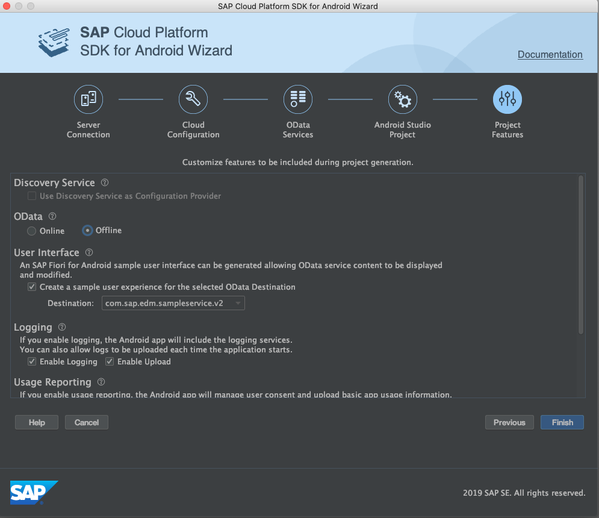

Creat an application from android studio integrated with SAP wizard.

1) Open android studio and choose "Start a new SAP Cloud Platform Android Project".

2) Once the wizard is open fill in the required fields as shown below and click next. 

3) On Cloud configuration tab, by default “use existing” tab is selected, make sure the application id “com.sap.android.sdk.demo” created in step2 of this document is selected from the drop down and click next. 

4) In the odata services tab, you will notice the sample service which was added as part of assigned features while creating the application in mobile services cockpit. Click next. 

5) On the android studio project tab provide the following configuration data and click next. 

6) On the projectc features tab, provide the following configuration data. 

    | Field | Value |
    | ------------- |-------------|
    | Use Discovery service as configuration provider | Uncheck |
    | Odata | Check |
    | Create a sample user experience for the selected odata destination | Check |
    | Enable Logging | Check |
    | Enable Upload | Check |
    | Enable Usage Reporting | Uncheck |

    
    

7) Click finish on the project features tab. The project gets genereated and wait for the build to finish. 

8) Choose teh emulator for running the app.
    for more information on creating virutual Devices that run in the android emulator, see [here](https://developer.android.com/studio/run/managing-avds).

    Click the Run toolbar icon.

    

9) The Welcome screen is shown the first time the app is launches.

    

    Sign in with your credentails

    

    The passcode (or fingerprint if enabled) screen provides an additional layer of security for your app.

    

    The passcode policy can be modified in the mobile service cockpit under Client policies feature. 

    The first screen of the application shows all the entities that are present in sample odata service.

    
