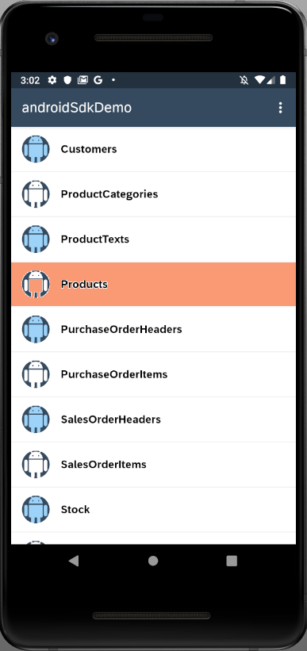
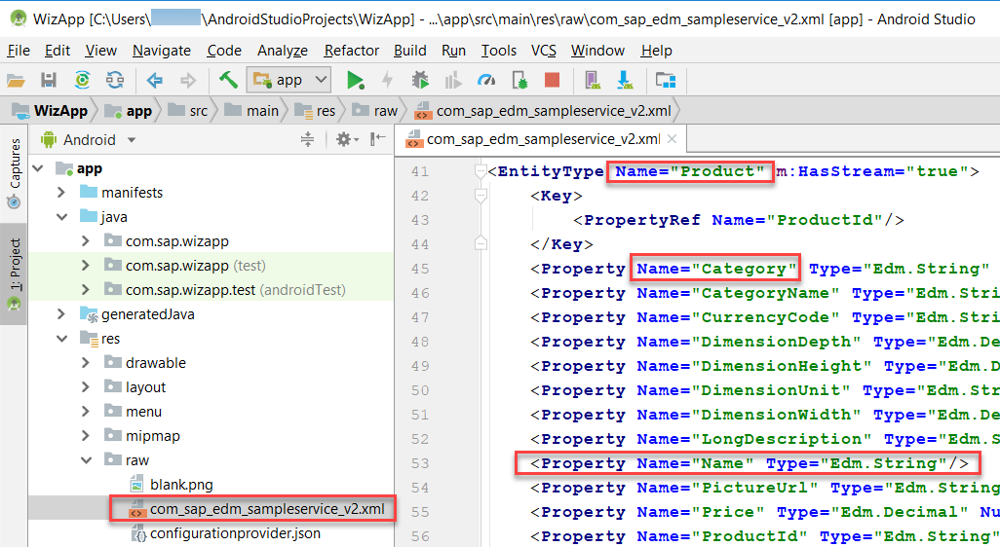

At the end of previous tutorial we geneated an application using android sap sdk wizard. The main view of the applicaiton shows all entities that are present in sample odata service.

1) Tap on the Products entity.

    

2) Notice that it displays the category name rather than the prodct name.

    

3) The category name is displayed (rather than the product name) because the app was generated from the OData service’s metadata which does not indicate which of the many fields from the product entity to display. When creating the sample user interface, the SDK wizard uses the first property found as the value to display. To view the complete metadata document, open the file res/raw/com_sap_edm_sampleservice_v2.xml.

    

4) In this section, the object cell will be configured to show a product’s name, category, description and price. As well, a separator decoration will be added between cells, and the sort order will be modified.

    In Android Studio, on Windows press Ctrl+N or on a Mac press command+O and type ProductsListActivity to open ProductsListFragment.java

    On Windows press Ctrl+F12 or on a Mac press command+F12 and type populateObjectCell to move to the populateObjectCell method.

    Change the parameter in getDataValue from Product.category to Product.name. This will cause the product name to be shown as the headline value of the object cell.

